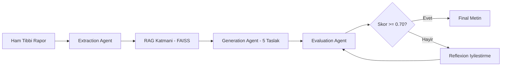
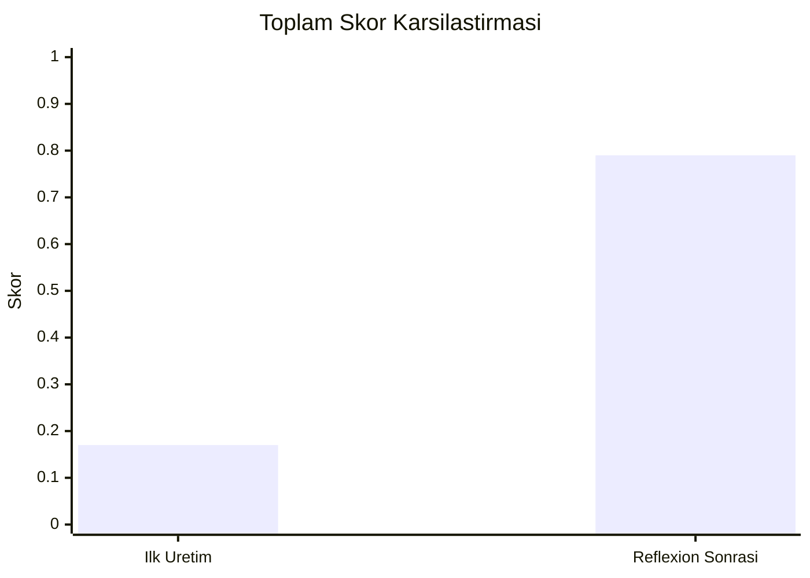

# Medical Text Simplification

Teknik tıbbi raporları, tıbbi doğruluğu koruyarak hasta dostu bir Türkçeye dönüştüren ajan tabanlı bir sistem.

## İçindekiler

- [Öne Çıkanlar](#öne-çıkanlar)
- [Sistem Mimarisi](#sistem-mimarisi)
- [Veri Seti](#veri-seti)
- [Performans Sonuçları](#performans-sonuçları)
- [Kurulum ve Çalıştırma](#kurulum-ve-çalıştırma)
- [Veri Klasörü (Repo Dışı)](#veri-klasörü-repo-dışı)
- [Proje Yapısı](#proje-yapısı)
- [Güvenlik](#güvenlik)

## Öne Çıkanlar

- **Agentic pipeline:** Extraction + RAG + Generation + Evaluation + Reflexion
- **Klinik doğruluk odaklı:** ICD kodlarını metinde korumayı hedefler
- **Okunabilirlik dengesi:** Ateşman skoru ile metin sadeliğini ölçer
- **İteratif iyileştirme:** Düşük skorda otomatik geri besleme döngüsü

## Sistem Mimarisi



### İş Akışı

1. **Extraction Agent:** Rapor içinden ICD-10 kodları ve teknik terimleri ayıklar.
2. **RAG Katmanı:** Cochrane benzer örneklerini getirir.
3. **Generation Agent:** 5 farklı sadeleştirme taslağı üretir.
4. **Evaluation Agent:** Ateşman + ICD eşleşmesi ile puanlar.
5. **Reflexion Loop:** Eşik altı skor varsa yeniden düzenleme yapar.

## Veri Seti

- **Kaynak:** Cochrane Plain Language Summaries
- **Dağılım:** 3568 train, 480 test paragraf çifti
- **Kullanım amacı:** FAISS üzerinden dinamik few-shot bağlam sağlama

## Performans Sonuçları

| Aşama | Ateşman | ICD Eşleşmesi | Toplam Başarı Skoru |
|---|---:|---:|---:|
| İlk Üretim (Taslak) | 83.31 | 0/4 (%0) | 0.17 |
| Reflexion Sonrası (Final) | 95.27 | 4/4 (%100) | 0.79 |

### Görsel Karşılaştırma



> Not: Eğer kullandığın GitHub görünümünde `xychart-beta` desteklenmiyorsa, tabloyu temel referans alabilir veya `docs/` altında PNG grafik ekleyebilirsin.

## Kurulum ve Çalıştırma

### 1) Gereksinimler

- Python 3.10+

### 2) Bağımlılıkları kur

```bash
pip install -r requirements.txt
```

### 3) Ortam değişkeni ayarla

```bash
copy .env.example .env
```

`.env` içeriği:

```env
GROQ_API_KEY=your_real_key
```

### 4) Uygulamayı çalıştır

```bash
python main.py
```

## Veri Klasörü (Repo Dışı)

`data/` klasörü büyük boyutlu olduğu için bilerek GitHub reposuna dahil edilmez.  
Bu nedenle `.gitignore` içinde dışarıda tutulur.

Sistem aşağıdaki yapıyı bekler:

```text
data/
  data-1024/
    train.source
    train.target
    train.doi
    val.source
    val.target
    val.doi
    test.source
    test.target
    test.doi
```

### Veri edinme

1. Cochrane PLS ham verisini veya daha önce hazırladığın işlenmiş paketi indir.
2. Dosyaları yukarıdaki dizin yapısına yerleştir.
3. `python main.py` ile testi çalıştır.

## Proje Yapısı

```text
Medical Text Simplification/
  agents/
    extraction_agent.py
    groq_generation_agent.py
    generation_agent.py
  utils/
    metrics.py
    vector_database.py
  data/                      # repoya dahil degil
  main.py
  requirements.txt
  .env.example
  .gitignore
  README.md
```

## Güvenlik

- API key, token ve benzeri hassas bilgiler repoya eklenmez.
- `.env` dosyası `.gitignore` ile korunur.
- Daha önce sızmış anahtarlar varsa iptal edilip yeni anahtar üretilmelidir.

