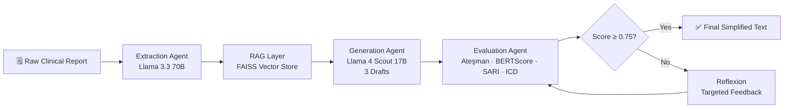

<div align="center">

# 🏥 Medical Text Simplification

### An Agentic AI Pipeline for Patient-Friendly Clinical Reports

[](https://python.org)
[](https://fastapi.tiangolo.com)
[](https://react.dev)
[](https://typescriptlang.org)
[](https://langchain.com)
[](https://faiss.ai)
[](LICENSE)

**Transforms complex Turkish clinical reports into patient-friendly language — without sacrificing medical accuracy.**

[Features](#-features) · [Architecture](#-architecture) · [Results](#-results) · [Installation](#-installation) · [Project Structure](#-project-structure)

</div>

---

## 🌟 Overview

**Medical Text Simplification** is a full-stack agentic AI system designed to bridge the gap between clinical documentation and patient comprehension. It takes dense, technical Turkish medical reports and rewrites them in plain language that a 10th-grader can understand — all while preserving critical medical information like ICD-10 codes.

The system uses a multi-agent pipeline powered by state-of-the-art LLMs (via [Groq](https://groq.com)), a Retrieval-Augmented Generation (RAG) layer backed by [FAISS](https://faiss.ai), and a self-evaluating **Reflexion** loop that automatically improves low-scoring outputs.

---

## ✨ Features

- **🤖 Agentic Pipeline** — Extraction → RAG → Generation → Evaluation → Reflexion, all automated
- **🔍 RAG-Powered Context** — Dynamically retrieves similar Cochrane Plain Language examples via FAISS to guide generation
- **📊 Multi-Metric Evaluation** — Scores each draft on Ateşman readability, BERTScore (semantic fidelity), SARI (simplification quality), and ICD-10 code preservation
- **🔄 Reflexion Loop** — If the best draft scores below the threshold, the system automatically refines it with targeted feedback
- **🛡️ Safety Guards** — Metric regression filters prevent reflexion from making the text worse
- **🌐 Full-Stack UI** — React + TypeScript frontend with live simplification tool, architecture overview, and animated metrics display
- **⚡ Fast Inference** — Powered by Groq API for near-instant LLM calls

---

## 🏗️ Architecture

The pipeline consists of five sequential stages:



### Stage-by-Stage Breakdown

| Stage | Component | Model / Tool | Purpose |
|---|---|---|---|
| **1. Extraction** | `ExtractionAgent` | Llama 3.3 70B | Pulls ICD-10 codes & technical terms from the report |
| **2. RAG** | `MedicalVectorStore` | FAISS + sentence-transformers | Fetches the 3 most similar Cochrane PLS examples |
| **3. Generation** | `GenerationAgent` | Llama 4 Scout 17B | Produces 3 candidate simplifications using dynamic few-shot prompts |
| **4. Evaluation** | `metrics.py` | Ateşman, BERTScore, SARI | Scores each draft; selects the best |
| **5. Reflexion** | `refine_draft()` | Llama 4 Scout 17B | Rewrites the best draft with structured feedback if score < 0.75 |

---

## 📊 Results

### Before vs. After Reflexion

| Metric | Initial Draft | After Reflexion | Improvement |
|---|:---:|:---:|:---:|
| **Ateşman Readability** | 83.31 | 95.27 | +14% |
| **ICD Code Preservation** | 0 / 4 (0%) | 4 / 4 (100%) | **+100%** |
| **Overall Success Score** | 0.17 | 0.79 | **+365%** |

> **Ateşman score guide:** 90–100 = very easy (elementary), 70–89 = easy (middle school), 50–69 = medium, <50 = difficult. The system targets 70+.

---

### 📈 Performance Charts

Three chart types are automatically generated for every run and saved to `Model/plots/`:

**Multi-Metric Line Chart** — tracks Ateşman, BERTScore, and SARI across all generated drafts:


---

**Radar Chart** — shows the multi-dimensional profile of the best-selected draft:


---

**Scatter Plot** — plots the readability–accuracy trade-off across all drafts:


---

### 📐 Evaluation Metrics Explained

| Metric | What It Measures | Target |
|---|---|---|
| **Ateşman** | Turkish readability index (analogous to Flesch Reading Ease) | > 70 |
| **BERTScore** | Semantic similarity to the original report — measures how much meaning is preserved | > 0.60 |
| **SARI** | Simplification quality — rewards correct word deletions and additions relative to reference | > 0.20 |
| **ICD-10 Match** | Fraction of extracted ICD-10 codes that appear in the simplified output | 100% |

The final scoring formula that drives draft selection:

```
Score = 0.35 × BERTScore + 0.25 × ICD Accuracy + 0.20 × Ateşman (normalized) + 0.20 × SARI
```

Drafts with BERTScore < 0.55 or SARI < 0.20 are automatically discarded before selection.

---

## 🗄️ Dataset

The RAG vector store is built on the **Cochrane Plain Language Summaries (PLS)** corpus — a gold-standard dataset of paired technical/plain medical texts.

| Split | Pairs |
|---|:---:|
| Train | 3,568 |
| Validation | — |
| Test | 480 |

At runtime, the three most semantically similar training examples to the input report are retrieved and injected into the generation prompt as dynamic few-shot demonstrations.

---

## 🛠️ Tech Stack

| Layer | Technology |
|---|---|
| **LLM Inference** | [Groq API](https://groq.com) — Llama 3.3 70B (extraction) · Llama 4 Scout 17B (generation) |
| **Orchestration** | [LangChain](https://langchain.com) — prompt templates, chains, few-shot prompting |
| **Vector Search** | [FAISS](https://faiss.ai) · sentence-transformers (embeddings) |
| **Evaluation** | BERTScore · custom Ateşman implementation · SARI · matplotlib |
| **Backend API** | [FastAPI](https://fastapi.tiangolo.com) · Uvicorn |
| **Frontend** | React 18 · TypeScript · Vite · Lucide Icons |

---

## 🚀 Installation

### Prerequisites

- Python 3.10+
- Node.js 18+
- A [Groq API key](https://console.groq.com) (free tier available)

### Backend Setup

```bash
# 1. Clone the repository
git clone https://github.com/murattahayavas/medical-text-simplification.git
cd medical-text-simplification/Model

# 2. Install Python dependencies
pip install -r requirements.txt

# 3. Configure your API key
copy .env.example .env
# Then open .env and set:
# GROQ_API_KEY=your_key_here
```

### Data Setup

The `data/` folder is excluded from this repository due to file size. The system expects the following structure:

```
Model/data/data-1024/
  ├── train.source   # Technical medical texts
  ├── train.target   # Simplified plain-language versions
  ├── train.doi      # Document identifiers
  ├── val.source / val.target / val.doi
  └── test.source / test.target / test.doi
```

Download the Cochrane PLS dataset and place the files as shown above, then the FAISS index will be built automatically on first run.

### Running the Backend

```bash
# Option A: Run the pipeline directly (CLI)
python main.py

# Option B: Start the FastAPI server
uvicorn api:app --reload --port 8000
# API docs available at http://localhost:8000/docs
```

### Frontend Setup

```bash
cd klinik-metin-arayuzu-main/klinik-metin-arayuzu-main

# Install dependencies
npm install

# Set the backend URL
cp .env.example .env
# VITE_API_URL=http://localhost:8000

# Start the dev server
npm run dev
# Open http://localhost:5173
```

Or use the convenience scripts:

```powershell
# Backend
./Model/run_backend.ps1

# Frontend
./klinik-metin-arayuzu-main/klinik-metin-arayuzu-main/run_frontend.ps1
```

### API Usage

```bash
# Health check
curl http://localhost:8000/health

# Simplify a medical report
curl -X POST http://localhost:8000/simplify \
  -H "Content-Type: application/json" \
  -d '{"text": "Sol tiroid lojunda 14x7x16 mm boyutunda hipoekoik görünüm izlendi..."}'
```

**Response:**
```json
{
  "simplified": "Sol tiroid bölgesinde 14x7x16 mm büyüklüğünde, normalden farklı görünen bir alan tespit edildi..."
}
```

---

## 📁 Project Structure

```
Medical Text Simplification/
│
├── Model/                          # Python backend
│   ├── agents/
│   │   ├── extraction_agent.py     # ICD-10 & term extraction (Llama 3.3 70B)
│   │   ├── generation_agent.py     # Draft generation base class
│   │   └── groq_generation_agent.py# Groq-powered generation + reflexion (Llama 4 Scout)
│   ├── utils/
│   │   ├── metrics.py              # Ateşman, BERTScore, SARI, evaluation, plotting
│   │   └── vector_database.py      # FAISS vector store builder & retriever
│   ├── data/                       # ⚠️ Not included in repo (see Data Setup)
│   │   └── data-1024/              # Cochrane PLS dataset splits
│   ├── plots/                      # Auto-generated metric charts
│   ├── api.py                      # FastAPI REST API
│   ├── main.py                     # Main pipeline entrypoint
│   ├── requirements.txt
│   └── run_backend.ps1
│
├── klinik-metin-arayuzu-main/      # React/TypeScript frontend
│   └── klinik-metin-arayuzu-main/
│       └── src/
│           └── components/
│               ├── SimplifierTool/ # Live text simplification UI
│               ├── Architecture/   # System architecture visualization
│               ├── Metrics/        # Animated performance metrics
│               ├── Features/       # Feature highlights
│               └── ...
│
└── README.md
```


---

## 📄 License

This project is licensed under the **MIT License** — see the [LICENSE](Model/LICENSE) file for details.

---

<div align="center">

Built with ❤️ using Groq · LangChain · FAISS · FastAPI · React

</div>
